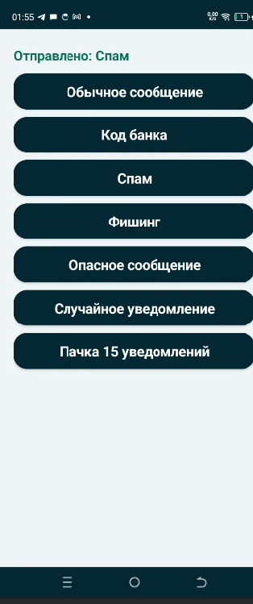

# SMSTestSender ML — тестовое приложение для Детектор спама


## Описание проекта

**SMSTestSender ML** — вспомогательное Android-приложение для тестирования основного приложения **Детектор спама**. Позволяет отправлять тестовые уведомления разных типов, чтобы проверить корректность классификации спама, фишинга, банковских кодов и других категорий.

Приложение не содержит ML-модели и работает как генератор тестовых уведомлений.

## Возможности

| Кнопка | Что отправляет |
|--------|----------------|
| Обычное сообщение | Бытовые сообщения (встреча, лекция, покупки) |
| Код банка | Коды подтверждения, банковские уведомления |
| Спам | Выигрыши, скидки, кредиты |
| Фишинг | Подозрительные ссылки, блокировки |
| Опасное сообщение | Угрозы, шантаж |
| Случайное уведомление | Любой тип из перечисленных |
| Пачка 15 уведомлений | Отправляет 15 сообщений разных типов подряд |

## Скриншот



*Рисунок 1 – Интерфейс тестового приложения с кнопками для отправки уведомлений*

## Основной сценарий работы

1. Пользователь устанавливает на устройство основное приложение **Детектор спама**.
2. Включает доступ к уведомлениям для основного приложения.
3. Запускает **SMSTestSender ML**.
4. Нажимает любую кнопку для отправки тестового уведомления.
5. Уведомление появляется в шторке и автоматически перехватывается основным приложением.
6. Результат классификации отображается в **Детекторе спама**.

## Структура проекта

```
SMSTestSender-ML/
└── app/
    └── src/
        └── main/
            ├── java/com/example/smstestsendermllr4/
            │   └── MainActivity.kt              # Главная активность (отправка уведомлений)
            ├── res/
            │   ├── drawable/
            │   │   └── ic_stat_sms.xml          # Иконка для уведомлений
            │   └── values/
            │       ├── themes.xml               # Тема приложения
            │       └── strings.xml              # Название приложения
            ├── AndroidManifest.xml
            └── build.gradle.kts
```

### Назначение файлов

| Файл | Назначение |
|------|-------------|
| `MainActivity.kt` | Интерфейс с кнопками, отправка уведомлений через NotificationManager |
| `themes.xml` | Тема приложения (тёмно-бирюзовая, как у основного приложения) |
| `strings.xml` | Название приложения |
| `ic_stat_sms.xml` | Иконка для уведомлений |

## Требования для сборки

| Компонент | Версия |
|-----------|--------|
| Android Studio | Ladybug / Koala / Hedgehog |
| Min SDK | API 26 (Android 8.0) |
| Язык | Kotlin |

## Зависимости

Приложение не требует дополнительных зависимостей — используется только стандартный Android SDK.

## Разрешения

```xml
<uses-permission android:name="android.permission.POST_NOTIFICATIONS" />
```

Для Android 13+ при первом запуске запрашивается разрешение на отправку уведомлений.

## Установка и запуск

### 1. Копируйте репозиторий

```bash
git clone https://github.com/Slbjg/SMSTestSender-ML.git
```

### 2. Откройте проект в Android Studio

`File → Open` → выберите папку проекта → дождитесь синхронизации

### 3. Запустите приложение

Нажмите **Run ▶️**

## Использование

1. Установите основное приложение **SMSShield ML** и включите доступ к уведомлениям
2. Запустите **SMSTestSender ML**
3. Нажимайте кнопки для отправки тестовых уведомлений
4. Откройте **Детектор спама** и проверьте результаты классификации

## Примеры отправляемых сообщений

### Обычные сообщения

```
Привет, я уже выехал. Буду через 15 минут.
Завтра встречаемся после пары, не забудь тетрадь.
Пара перенесена на 12:00.
```

### Банковские коды

```
СберБанк: код подтверждения 4812. Никому не сообщайте код.
Тинькофф: для входа используйте код 774920.
Карта *1234: списание 560 руб. Если это не вы, обратитесь в банк.
```

### Спам

```
Поздравляем! Вы выиграли приз. Заберите подарок по ссылке http://bonus-win.ru
Скидка 90% только сегодня! Перейдите на www.sale-priz.com
Заработок от 10000 рублей в день без опыта, пишите сейчас.
```

### Фишинг

```
Ваша карта заблокирована. Срочно подтвердите данные: http://bank-check.ru
Служба безопасности: обнаружен вход. Введите пароль по ссылке.
Ваш аккаунт будет удален. Подтвердите личность немедленно.
```

### Опасные сообщения

```
Я тебя найду и разберусь, если не ответишь.
Ты пожалеешь, если не сделаешь как сказано.
Это шантаж: отправь деньги или данные уйдут всем.
```


## Связь с основным приложением

| Приложение | Ссылка |
|------------|--------|
| Детектор спама (основное) | [https://github.com/Slbjg/SMSShield-ML]() |

## 
